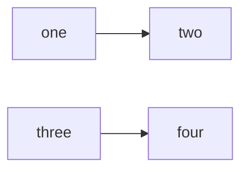

# Dot net Learning

### Table of Contents
  - [Introduction to .Net](./Intruduction.md)
  - [JavaScritp](./JavaScript/Intruduction.md)
  - [Responsive Layouts](./ResponsiveLayout/README.md)

```
Goal: Solid front-end fundamentals. No frameworks until JS is strong.
```

[Ref for mermaid](https://mermaid.js.org/ecosystem/integrations-community.html)

